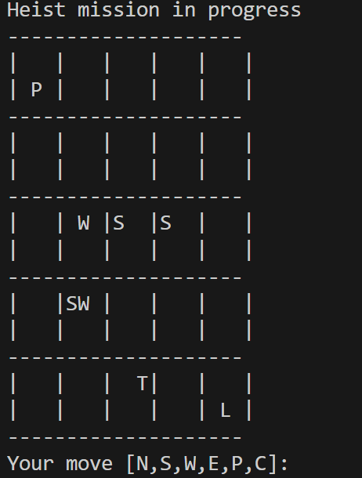

# Heist Maze Game - C++ Console Application

## Overview

Heist Maze Game is a console-based maze exploration game written in C++. The game challenges players to steal the Loot from a maze filled with enemies (Scouts, Wanderers, and Trackers). User controls the main character (Player) and must navigate the maze while avoiding or outsmarting the enemy characters.

## Characters

### Enemy Types

1. **Scout (Symbol: 'S')**
   - Symbol: 'S'
   - Movement: Scouts move randomly after every player move.
   - Behavior: Scouts randomly select a direction (North, South, East, or West) and move in that direction. They are unpredictable and can move anywhere within the maze.

2. **Wanderer (Symbol: 'W')**
   - Symbol: 'W'
   - Movement: Wanderers have a 20% chance of moving in a random direction after every player move.
   - Behavior: Wanderers often stay in place but occasionally make a random move. They are less predictable than Scouts but don't move as frequently.

3. **Tracker (Symbol: 'T')**
   - Symbol: 'T'
   - Movement: Trackers move strategically towards the player in either the x or y direction.
   - Behavior: Trackers are intelligent enemies that actively try to get closer to the player. They choose the direction (North, South, East, or West) that brings them closer to the player's position.

### Ally Symbols

1. **Player (Symbol: 'P')**
   - Symbol: 'P'
   - Meaning: The player controls this character. The objective of the game is for the player to navigate through the maze, avoid enemies, and reach the Loot.
   - Behavior: The player can move in different directions using specific input commands ('N' for North, 'S' for South, 'W' for West, 'E' for East, 'P' to pick up the Loot, and 'C' to continue without moving).

2. **Loot (Symbol: 'L')**
   - Symbol: 'L'
   - Meaning: The Loot is an item that the player needs to collect. The objective of the game is to guide the Player to the position of the Loot and pick it up.
   - Behavior: The Loot does not move on its own. It remains in a fixed position within the maze until the player reaches its location and picks it up.

### User Input

- The player controls the main character (Symbol: 'P') and can move in different directions using specific input commands.
- User Input Commands:
   - 'N': Move North.
   - 'S': Move South.
   - 'W': Move West.
   - 'E': Move East.
   - 'P': Pick up the Loot (if the player is on the same tile as the Loot).
   - 'C': Continue without moving (useful for waiting or strategic planning).
     
The player's goal is to navigate the maze using these commands, reach the Loot (Symbol: 'L'), and pick it up then proceed to the title the player started (0,0). The game may have win or lose conditions based on the player's actions, such as encountering enemies or reaching the goal.

## How to Play

1. Clone the repository to your local machine.
2. Compile the source code using a C++ compiler (e.g., g++).
3. Run the compiled executable.
4. Follow the on-screen instructions to make your moves and navigate the maze.
5. Try to steal the Loot while avoiding or outsmarting the enemies.

## Customizing Game Settings

In this C++ console-based maze exploration game, you have the flexibility to customize various game settings by modifying the `constants.h` file. Here are some of the key settings you can adjust:

- **Number of Columns and Rows**
   - You can change the size of the maze by modifying the `NUM_OF_COLUMNS` and `NUM_OF_ROWS` constants. These constants determine the dimensions of the game grid.

- **Number of Enemy Types**
   - You can tailor the game's challenge by adjusting the number of different enemy types:
     - `NUM_OF_SCOUTS`: Controls the number of Scout enemies (Symbol: 'S').
     - `NUM_OF_WANDERERS`: Adjusts the quantity of Wanderer enemies (Symbol: 'W').
     - `NUM_OF_TRACKERS`: Determines the number of Tracker enemies (Symbol: 'T').

- Each tile on the game grid can contain at most one enemy of the same type. If multiple enemies of the same type are present in the same tile, they are represented by a single symbol for that enemy type.

Feel free to experiment with these settings to create your own unique maze and gaming experience.

## Author

- **Oscar Rodriguez**
- **Started:** August 21, 2023
- **Last Edited:** September 5, 2023
